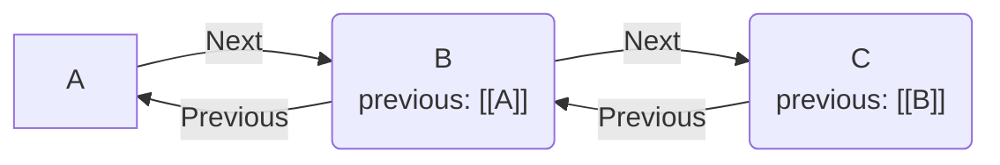

# Basic Functions and Property Operations of Previous River

## Purpose

To enable setting sequential relationships between notes in Obsidian. To automatically expand unidirectional links created by frontmatter properties into bidirectional links.

## Terminology

- **Previous Node**: The parent note pointed to by the `previous` property in the frontmatter of the current note.
- **Next Node**: A child note that references the current note via its `previous` property.
- **Root Node**: A note that either does not have a `previous` property or whose value is set to `ROOT` (the starting point of a thought chain).



## Design Philosophy

The data structures and access methods for managing the sequential relationships between notes have been defined.

| Consideration | Adopted Idea | Rejected Idea | Reason |
|---|---|---|---|
| Reference data format | Obsidian Wiki link `[[Note Name]]` | Plain text (file name) | To benefit from standard Obsidian features (Graph View, automatic updates on file rename). |
| Property reading method | Referencing `app.metadataCache` | `app.vault.read()` with regex parsing | Scanning text of all notes causes performance degradation (O(N)). Caching was utilized for speed. |
| Property writing method | `app.fileManager.processFrontMatter` | String replacement via `app.vault.modify` | String replacement risks YAML formatting corruption and conflicts. Used the official API for safe updates. |
| Searching for next notes | Reverse lookup of `app.metadataCache.resolvedLinks` | Scanning frontmatter of all files | To reduce scanning cost. The backlink dictionary is iterated via `for...in` to minimize memory allocation (avoiding `Object.entries`). |

## Implementation

### Getting Properties

Retrieve the property from the frontmatter cache. Verify that it is in a link format and extract the pure link path.

```typescript
export function getPreviousLinkpath(app: App, file: TFile): string | null {
  const cache = app.metadataCache.getFileCache(file);
  const previousName = cache?.frontmatter?.previous;

  if (!previousName?.includes("[[")) {
    return null;
  }
  return getLinkpath(extractLinktext(previousName));
}
```

### Setting Properties

Set the specified link path to the `previous` property. The frontmatter is updated safely and asynchronously using the official API.

```typescript
export async function setPreviousProperty(app: App, file: TFile, previousLink: string): Promise<void> {
  await app.fileManager.processFrontMatter(file, (fm) => {
    fm.previous = `[[${previousLink}]]`;
  });
}
```

### Getting Previous Note

Retrieve the note pointed to by the current note's `previous` property. Identify the target file using the metadata cache based on the link path set in the frontmatter.

```typescript
export function getPreviousNote(app: App, file: TFile): TFile | null {
  const previousLinkpath = getPreviousLinkpath(app, file);
  if (!previousLinkpath) {
    return null;
  }

  const target = app.metadataCache.getFirstLinkpathDest(
    previousLinkpath,
    file.path
  );

  if (!target) {
    new Notice(`Note "${previousLinkpath}" was not found.`);
    return null;
  }

  return target;
}
```

### Getting Next Notes

Retrieve all child notes that reference the current note via their `previous` property. To reduce scanning cost, reverse lookups are performed using the backlink dictionary (`app.metadataCache.resolvedLinks`).

```typescript
export function getNextNotes(app: App, file: TFile): TFile[] {
  const currentPath = file.path;
  const backlinks = app.metadataCache.resolvedLinks;
  const nextNotes: TFile[] = [];

  // Use Object properties directly (for...in) instead of Object.entries to prevent huge array allocations
  for (const sourcePath in backlinks) {
    if (!Object.prototype.hasOwnProperty.call(backlinks, sourcePath)) continue;

    const targets = backlinks[sourcePath];
    // Check if the source note links to the current note
    if (!targets || !targets[currentPath]) {
      continue;
    }

    const targetFile = app.vault.getAbstractFileByPath(sourcePath);
    if (!(targetFile instanceof TFile)) {
      continue;
    }

    const previousLinkText = getPreviousLinkpath(app, targetFile);
    if (!previousLinkText) {
      continue;
    }

    // Add only if the `previous` field points to the current note.
    if (previousLinkText === file.basename || previousLinkText === currentPath) {
      nextNotes.push(targetFile);
    }
  }

  return nextNotes;
}
```

### Detaching Notes

Remove the `previous` property from the current note. Simultaneously, rewire the `previous` property of subsequent notes to either the "current note's parent" or `ROOT` to prevent fragmentation of the entire chain.

```typescript
export async function detachNote(app: App, file: TFile, options?: { showNotification?: boolean }): Promise<void> {
  const previousLinkpath = getPreviousLinkpath(app, file);
  const nextNotes = getNextNotes(app, file);

  // Rewire the parent of subsequent notes
  for (const nextNote of nextNotes) {
    await app.fileManager.processFrontMatter(nextNote, (fm) => {
      fm.previous = previousLinkpath ? `[[${previousLinkpath}]]` : "ROOT";
    });
  }

  // Remove previous from the current note
  await app.fileManager.processFrontMatter(file, (fm) => {
    delete fm.previous;
  });
}
```

Various commands are implemented by combining these basic functions.


## Command List

The Previous River plugin provides the following commands.

| Command Name | Description |
|---|---|
| **Go to previous note** | Open the parent note (`previous`) of the current note |
| **Go to next note** | Open the child note of the current note. If there are multiple, display a suggest UI |
| **Go to first note** | Traverse back up the chain and open the starting node |
| **Go to last note** | Traverse down the chain and open the ending node. If there are branches, display a suggest UI |
| **Detach note** | Detach the current note from the chain. Links of subsequent notes are automatically repaired |
| **Insert note** | Insert the current note (and its subsequent chain) immediately after the specified note |
| **Insert note to first** | Insert the current note (and its subsequent chain) at the beginning of the chain that the specified note belongs to |
| **Insert note to last** | Insert the current note at the end of the chain that the specified note belongs to |
| **Copy next notes list** | Copy the tree structure text of subsequent notes starting from the current note to the clipboard |
| **Export next notes to canvas** | Export the network of subsequent notes starting from the current note as a Canvas file |
| **Export all rivers to canvas** | Export connections (chains) of all notes in the Vault in bulk as a Canvas file |
| **Export filtered rivers to canvas** | Export only the chains that match search criteria (path, tag, link, etc.) as a Canvas file |

## Use Cases

By utilizing Previous River, you can intuitively manage groups of notes in Obsidian as a "chain of thoughts."

### 1. Navigating smoothly back and forth between thoughts (Core Feature)

Seamlessly browse and edit across a series of notes using the "Go to previous note" and "Go to next note" commands.

- **Context-preserving navigation**: By assigning shortcut keys, you can instantly move to past notes that inspired an idea or future notes that continued it, without searching the file tree. This is the most frequently used feature.
- **Managing chronological records**: For notes that occur regularly, such as meeting minutes, daily reports, and 1on1 records, setting sequential relationships is very convenient as it allows you to trace past history in a daisy-chained manner.

### 2. Accessing the starting point and final conclusion of an idea

Easily access the origin and endpoint of a thought, even when a chain becomes long.

- **Reviewing the starting point**: Executing `Go to first note` takes you back to the note that was the origin of the current thought (root node).
- **Checking the conclusion**: Executing `Go to last note` takes you to the latest conclusive note derived from the current note.

### 3. Reorganizing the order and structure of notes later

Flexibly rearrange the order and dependencies of existing note groups at a later time.

- **Detaching a thought**: Use `Detach note` to separate the current note from the chain, making it an independent new starting point. Upon detachment, links of previous and next notes are automatically repaired.
- **Interrupting past thoughts**: Using insertion commands like `Insert note`, you can sandwich another note between notes, or merge notes to the beginning or end of an existing chain.

### 4. Integrating fragmented notes into permanent notes (Zettelkasten)

Highly effective for merging newly created permanent notes into relevant chains of permanent notes, as in the Zettelkasten method.

- **Systematizing thoughts**: Newly jotted notes can be inserted into the appropriate position (immediately after or at the end) of an existing permanent note using `Insert note` or `Insert note to last`.
- **Adding context**: By incorporating isolated notes into an existing chain, they are connected to past contexts and organized as part of a more valuable knowledge system.

## Commit Logs

Relevant key commit history is presented below.

- [4f199fd](https://github.com/ongaeshi/previous-river/commit/4f199fd) feat: Change current note's previous property value to ROOT
- [9755a18](https://github.com/ongaeshi/previous-river/commit/9755a18) refactor: Extract getPreviousNote()
- [c6dd657](https://github.com/ongaeshi/previous-river/commit/c6dd657) refactor: Extranct getNextNotes() function
- [c04ab83](https://github.com/ongaeshi/previous-river/commit/c04ab83) refactor: Rename to getPreviousLinkText
- [1911620](https://github.com/ongaeshi/previous-river/commit/1911620) refactor: Move functions to obsidian.ts

---
[001_chain_algorithm  (next) ➡️](001_chain_algorithm.md)
