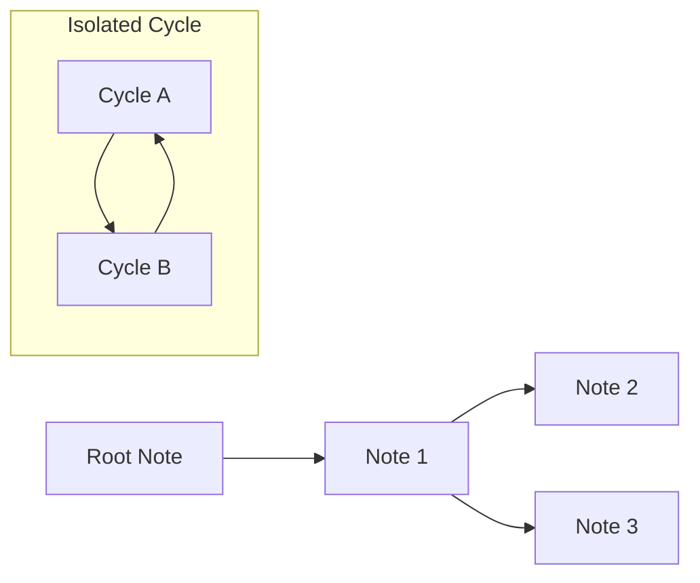

# Design and Implementation of Canvas Export Feature in Previous River

## Purpose

To provide a bird's-eye view and visualization of note connections (River) established by the `previous` property.
By exporting to the `.canvas` format, it achieves "complete control over node placement" and "giving meaning to arrow directions," which are difficult with Obsidian's standard Graph View. This allows for graphical representation of complex branching thoughts that cannot be fully grasped through text.

## Terminology

- **Root Note**: The starting point of a network that does not have a `previous` property (or whose reference does not exist) but is referenced as a parent by others.
- **Isolated Cycle**: An independent graph where all notes are circularly connected by `previous` and have no root.
- **Wrap Layout**: A layout that wraps placement to the left edge upon reaching a certain number of columns to prevent continuous, linear notes from becoming too wide horizontally.



## Design Philosophy

The following considerations were made regarding Canvas file generation and the layout algorithm.

| Consideration | Adopted Idea | Rejected Idea | Reason |
|---|---|---|---|
| Visualization method | Direct generation of `.canvas` files | Utilizing Obsidian Graph View | Because detailed node placement and drawing control for arrow directions (parent-child relationships) are impossible in Graph View. With the Canvas format, coordinates (x, y) and connecting edges can be completely controlled by calculation. |
| Node size | Enlarged height to `500px` | Default size | Because in the `.canvas` specification, the properties (Frontmatter) part cannot be folded by default, hiding the main text. Secured preview area for the main text. |
| Layout method | Introduction of Wrap Layout | Simple linear placement | Because a linear placement using DFS would stretch the Canvas horizontally when chains are long, reducing visibility. Set a maximum of `MAX_COLUMNS = 5` and adopted an algorithm that wraps to the left edge while shifting the Y-coordinate upon reaching this limit. |
| Edge direction | Drawn from parent to child (origin -> next note) | Drawn from child to parent (direction of `previous`) | Although actual internal links go "from child to parent", this was devised so that derivations of thought and the flow of time can be visually and intuitively grasped. |
| Separation between trees | Set a Y-coordinate margin of `+1000px` between individual networks | - | To ensure different graphs do not overlap when multiple roots or chains exist. |

## Implementation

### Defining Data Structures

Interface definitions were created in accordance with Obsidian's `.canvas` file format specification. This made it possible to describe coordinate calculations and edge connection directions in a type-safe and intuitive manner.

```typescript
export interface CanvasNode {
  id: string;
  x: number;
  y: number;
  width: number;
  height: number;
  type: "file";
  file: string;
}

export interface CanvasEdge {
  id: string;
  fromNode: string;
  fromSide: "top" | "right" | "bottom" | "left";
  toNode: string;
  toSide: "top" | "right" | "bottom" | "left";
}

export interface CanvasData {
  nodes: CanvasNode[];
  edges: CanvasEdge[];
}
```

### Layout Calculation

The logic for layout calculation and Canvas generation is consolidated in the `CanvasGenerator` class. It places nodes using DFS (Depth-First Search) and incorporates circular reference prevention and wrap processing.

```typescript
class CanvasGenerator {
  // ...
  dfs(current: TFile, col: number, y: number, direction: number): string {
    const existingNodeId = this.fileToNodeId.get(current.path);
    if (existingNodeId) return existingNodeId; // Prevention of infinite loops (cycles)

    // ...

    let isWrapped = false;
    if (nextCol >= this.MAX_COLUMNS) {
      nextCol = 0; // Return to the left edge
      nextY += yStep; // Move to the bottom row
      if (nextY > this.maxUsedY) this.maxUsedY = nextY;
      isWrapped = true;
    }
    
    // ...
    
    return nodeId;
  }
}
```

## Command List

The Previous River plugin provides the following commands related to Canvas export.

| Command Name | Description |
|---|---|
| **Export next notes to canvas** | Export the forward (child) network starting from the current note as a Canvas file |
| **Export all rivers to canvas** | Export connections (chains) of all notes existing in the Vault in bulk as a single Canvas file |
| **Export filtered rivers to canvas** | Extract and export only the networks belonging to notes that match search criteria (path, tag, link, etc.) as a Canvas file |

## Use Cases

- **Organizing complex thoughts**: Output the connections of Zettelkasten or linked memos as a Canvas to grasp the network structure and branches from a macro perspective.
- **Auditing the entire Vault**: Execute `Export all rivers to canvas` to find broken connections or isolated loops. This visualizes inconsistent reference structures between notes, providing clues for correction.
- **Analyzing specific projects**: Use `Export filtered rivers to canvas` to extract only the networks of note groups belonging to a specific directory or tag. This facilitates analysis focused on specific projects or themes.

## Commit Logs

Relevant key commit history is presented below.

- [ce6f0d3](https://github.com/ongaeshi/previous-river/commit/ce6f0d3) feat: Add command to export the next notes tree to a Canvas file
- [9e89cc6](https://github.com/ongaeshi/previous-river/commit/9e89cc6) feat: Add command to export all connected notes to a Canvas file
- [9432f29](https://github.com/ongaeshi/previous-river/commit/9432f29) refactor: Add confirmation dialog and extract canvas generation logic
- [7716d36](https://github.com/ongaeshi/previous-river/commit/7716d36) style: Increase Canvas node height and adjust vertical margins
- [511e448](https://github.com/ongaeshi/previous-river/commit/511e448) feat: Add  export-filtered-rivers-to-canvas command

---
[⬅️ (previous) 002_find_last_note_optimization](002_find_last_note_optimization.md)
