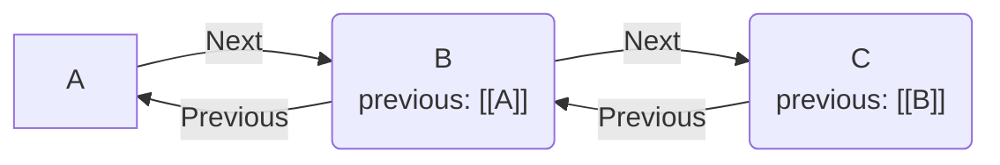

# Previous River の基本機能とプロパティ操作

## 目的

Obsidianのノート間に前後関係を設定できるようにする。フロントマターのプロパティによる単方向リンクを、自動的に双方向リンクへ拡張する。

## 用語の定義

- **Previous Node**: カレントノートのフロントマター `previous` プロパティが指し示す親ノート。
- **Next Node**: カレントノートを `previous` プロパティで参照している子ノート。
- **Root Node**: `previous` プロパティを持たない、または値が `ROOT` に設定されているノート（思考チェインの始点）。



## 設計方針

ノート間の順序関係を管理するためのデータ構造とアクセス方式について定義した。

| 検討項目 | 採用案 | 却下案 | 理由 |
|---|---|---|---|
| 参照データの形式 | Obsidian Wikiリンク `[[Note Name]]` | 単なるテキスト（ファイル名） | Obsidianの標準機能（Graph View、ファイル名変更時の自動更新）の恩恵を受けるため。 |
| プロパティの読み取り方式 | `app.metadataCache` の参照 | `app.vault.read()` と正規表現による解析 | 全ノートのテキスト走査はパフォーマンス劣化（O(N)）を招くため。キャッシュを利用し高速化を図った。 |
| プロパティの書き込み方式 | `app.fileManager.processFrontMatter` | `app.vault.modify` による文字列置換 | 文字列置換はYAMLのフォーマット崩れや競合のリスクがある。公式APIで安全に更新するため。 |
| 次のノート(Next)の検索 | `app.metadataCache.resolvedLinks` の逆引き | 全ファイルのフロントマター走査 | 走査コストを削減するため。バックリンク辞書を `for...in` で走査し、メモリアロケーションを最小限に抑えた（`Object.entries` を回避）。 |

## 実装

### プロパティの取得

フロントマターのキャッシュからプロパティを取得する。リンク形式であることを確認し、純粋なリンクパスを抽出する。

```typescript
export function getPreviousLinkpath(app: App, file: TFile): string | null {
  const cache = app.metadataCache.getFileCache(file);
  const previousName = cache?.frontmatter?.previous;

  if (!previousName?.includes("[[")) {
    return null;
  }
  return getLinkpath(extractLinktext(previousName));
}
```

### プロパティの設定

指定したリンクパスを `previous` プロパティに設定する。公式APIを用いてフロントマターを安全かつ非同期に更新する。

```typescript
export async function setPreviousProperty(app: App, file: TFile, previousLink: string): Promise<void> {
  await app.fileManager.processFrontMatter(file, (fm) => {
    fm.previous = `[[${previousLink}]]`;
  });
}
```

### 前のノートを取得

カレントノートの `previous` プロパティが指し示すノートを取得する。フロントマターに設定されたリンクパスから、メタデータキャッシュを用いて対象のファイルを特定する。

```typescript
export function getPreviousNote(app: App, file: TFile): TFile | null {
  const previousLinkpath = getPreviousLinkpath(app, file);
  if (!previousLinkpath) {
    return null;
  }

  const target = app.metadataCache.getFirstLinkpathDest(
    previousLinkpath,
    file.path
  );

  if (!target) {
    new Notice(`Note "${previousLinkpath}" was not found.`);
    return null;
  }

  return target;
}
```

### 後ろのノート群を取得

カレントノートを `previous` プロパティで参照しているすべての子ノートを取得する。走査コストを削減するため、バックリンク辞書（`app.metadataCache.resolvedLinks`）を利用して逆引き検索を行う。

```typescript
export function getNextNotes(app: App, file: TFile): TFile[] {
  const currentPath = file.path;
  const backlinks = app.metadataCache.resolvedLinks;
  const nextNotes: TFile[] = [];

  // Use Object properties directly (for...in) instead of Object.entries to prevent huge array allocations
  for (const sourcePath in backlinks) {
    if (!Object.prototype.hasOwnProperty.call(backlinks, sourcePath)) continue;

    const targets = backlinks[sourcePath];
    // Check if the source note links to the current note
    if (!targets || !targets[currentPath]) {
      continue;
    }

    const targetFile = app.vault.getAbstractFileByPath(sourcePath);
    if (!(targetFile instanceof TFile)) {
      continue;
    }

    const previousLinkText = getPreviousLinkpath(app, targetFile);
    if (!previousLinkText) {
      continue;
    }

    // Add only if the `previous` field points to the current note.
    if (previousLinkText === file.basename || previousLinkText === currentPath) {
      nextNotes.push(targetFile);
    }
  }

  return nextNotes;
}
```

### ノートのデタッチ

カレントノートから `previous` プロパティを削除する。同時に、後続ノートの `previous` を「カレントノートの親」または `ROOT` に付け替えることで、チェイン全体の分断を防ぐ。

```typescript
export async function detachNote(app: App, file: TFile, options?: { showNotification?: boolean }): Promise<void> {
  const previousLinkpath = getPreviousLinkpath(app, file);
  const nextNotes = getNextNotes(app, file);

  // 後続ノートの親を付け替える
  for (const nextNote of nextNotes) {
    await app.fileManager.processFrontMatter(nextNote, (fm) => {
      fm.previous = previousLinkpath ? `[[${previousLinkpath}]]` : "ROOT";
    });
  }

  // カレントノートから previous を削除する
  await app.fileManager.processFrontMatter(file, (fm) => {
    delete fm.previous;
  });
}
```

これらの基本関数を組み合わせて各種コマンドが実装されている。


## コマンド一覧

Previous River プラグインでは以下のコマンドが提供されている。

| コマンド名 | 概要 |
|---|---|
| **Go to previous note** | カレントノートの親ノート（`previous`）を開く |
| **Go to next note** | カレントノートの子ノートを開く。複数ある場合はサジェストUIを表示する |
| **Go to first note** | チェインを遡り、始点となるノートを開く |
| **Go to last note** | チェインを下り、終点となるノートを開く。分岐がある場合はサジェストUIを表示する |
| **Detach note** | チェインからカレントノートを切り離す。後続ノートのリンクは自動修復される |
| **Insert note** | カレントノート（およびその後続チェイン）を指定したノートの直後に挿入する |
| **Insert note to first** | カレントノート（およびその後続チェイン）を指定したノートの属するチェインの先頭に挿入する |
| **Insert note to last** | カレントノートを指定したノートの属するチェインの末尾に挿入する |
| **Copy next notes list** | カレントノートを起点とした後続ノートのツリー構造テキストをクリップボードにコピーする |
| **Export next notes to canvas** | カレントノートを起点とした後続ノートのネットワークをCanvasファイルとして出力する |
| **Export all rivers to canvas** | Vault内のすべてのノートのつながり（チェイン）をCanvasファイルとして一括出力する |
| **Export filtered rivers to canvas** | 検索条件（パス、タグ、リンク等）に合致するチェインのみをCanvasファイルとして出力する |

## ユースケース

Previous River を活用することで、Obsidian内のノート群を「思考の連なり（チェイン）」として直感的に操作できる。

### 1. 前後の思考をスムーズにたどる（主要機能）

「前のノートへ移動」および「次のノートへ移動」コマンドを用いることで、一連のノートをまたいだ閲覧や編集をスムーズに行う。

- **文脈を維持したナビゲーション**: ショートカットキーを割り当てることで、ファイルツリーを探すことなく、アイデアの元になった過去のメモや、その続きを書いた未来のメモへ即座に移動できる。最も利用頻度が高い機能である。
- **時系列記録の管理**: 定例ミーティングの議事録や日報、1on1の記録など、定期的に発生するメモに対して前後関係を設定しておくと、過去の履歴を数珠つなぎにたどることができ非常に便利である。

### 2. アイデアの出発点と最終結論へアクセスする

チェインが長くなった場合でも、思考の起点と終点へ簡単にアクセスできる。

- **起点の振り返り**: `Go to first note` を実行すると、現在の思考の原点となったノート（ルートノード）に戻る。
- **結論の確認**: `Go to last note` を実行すると、現在のノートから派生した最新の結論ノートへ移動する。

### 3. ノートの順序や構成を後から整理する

作成済みのノート群に対して、後から柔軟に順序や依存関係を組み替える。

- **思考の切り離し**: `Detach note` により、現在のノートをチェインから切り離し、独立した新しい起点とする。切り離し時、前後のノートのリンクは自動的に修復される。
- **過去の思考への割り込み**: `Insert note` をはじめとする挿入コマンドにより、ノート間に別のノートを挟んだり、既存のチェインの先頭や末尾にノートを合流させたりできる。

### 4. 断片的なメモを永続メモ（Zettelkasten）に統合する

Zettelkastenメソッドなどにおいて、作成した永続メモ（Permanent Note）を、関連する永続メモのチェインへ合流させる際に威力を発揮する。

- **思考の体系化**: 新しく書き留めたメモを `Insert note` や `Insert note to last` を用いて、既存の永続メモの適切な位置（直後や末尾）に挿入できる。
- **文脈の付与**: 孤立していたメモが既存のチェインに組み込まれることで、過去の文脈と繋がり、より価値の高い知識体系の一部として整理される。

## コミットログ

関連する主要なコミット履歴を提示する。

- [4f199fd](https://github.com/ongaeshi/previous-river/commit/4f199fd) feat: カレントノートのpreviousプロパティ値をROOTに変更
- [9755a18](https://github.com/ongaeshi/previous-river/commit/9755a18) refactor: getPreviousNote() を抽出
- [c6dd657](https://github.com/ongaeshi/previous-river/commit/c6dd657) refactor: getNextNotes() 関数を抽出
- [c04ab83](https://github.com/ongaeshi/previous-river/commit/c04ab83) refactor: getPreviousLinkText にリネーム
- [1911620](https://github.com/ongaeshi/previous-river/commit/1911620) refactor: 関数群を obsidian.ts に移動

---
[001_chain_algorithm  (next) ➡️](001_chain_algorithm.md)
