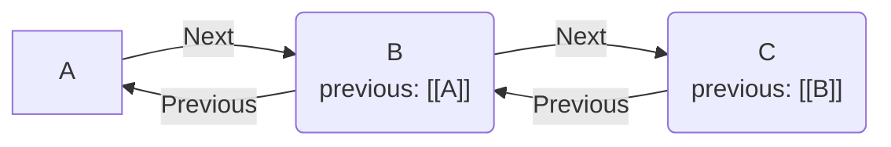

# Previous River の基本機能とプロパティ操作

## 1. 背景と目的 (Background)

Zettelkastenや連想に基づくノート管理において、ノート間の前後関係（思考のチェイン）を機械的に追跡・操作する。Obsidianのメタデータ（フロントマター）を活用し、双方向リンクのネットワークから特定の一連の流れを抽出・維持する。

## 2. 概念定義 (Definitions)

- **Previous Node**: カレントノートのフロントマター `previous` プロパティが指し示す親ノート。
- **Next Node**: カレントノートを `previous` プロパティで参照している子ノート。
- **Root Node**: `previous` プロパティを持たない、または値が `ROOT` に設定されているノート（思考チェインの始点）。



## 3. 設計意図/ADR (Design Decisions)

ノート間の順序関係を管理するためのデータ構造とアクセス方式について定義した。

| 検討項目 | 採用案 | 却下案 | 理由 |
|---|---|---|---|
| 参照データの形式 | Obsidian Wikiリンク `[[Note Name]]` | 単なるテキスト（ファイル名） | Obsidianの標準機能（Graph View、ファイル名変更時の自動更新）の恩恵を受けるため。 |
| プロパティの読み取り方式 | `app.metadataCache` の参照 | `app.vault.read()` と正規表現による解析 | 全ノートのテキスト走査はパフォーマンス劣化（O(N)）を招くため。キャッシュを利用し高速化を図った。 |
| プロパティの書き込み方式 | `app.fileManager.processFrontMatter` | `app.vault.modify` による文字列置換 | 文字列置換はYAMLのフォーマット崩れや競合のリスクがある。公式APIで安全に更新するため。 |
| 次のノート(Next)の検索 | `app.metadataCache.resolvedLinks` の逆引き | 全ファイルのフロントマター走査 | 走査コストを削減するため。バックリンク辞書を `for...in` で走査し、メモリアロケーションを最小限に抑えた（`Object.entries` を回避）。 |

## 4. 実装 (Implementation)

### プロパティの取得 (Get)

フロントマターのキャッシュからプロパティを取得する。リンク形式であることを確認し、純粋なリンクパスを抽出する。

```typescript
export function getPreviousLinkpath(app: App, file: TFile): string | null {
  const cache = app.metadataCache.getFileCache(file);
  const previousName = cache?.frontmatter?.previous;

  if (!previousName?.includes("[[")) {
    return null;
  }
  return getLinkpath(extractLinktext(previousName));
}
```

### プロパティの設定 (Set)

指定したリンクパスを `previous` プロパティに設定する。公式APIを用いてフロントマターを安全かつ非同期に更新する。

```typescript
export async function setPreviousProperty(app: App, file: TFile, previousLink: string): Promise<void> {
  await app.fileManager.processFrontMatter(file, (fm) => {
    fm.previous = `[[${previousLink}]]`;
  });
}
```

### プロパティの削除と切り離し (Delete)

カレントノートから `previous` プロパティを削除する。同時に、後続ノートの `previous` を「カレントノートの親」または `ROOT` に付け替えることで、チェイン全体の分断を防ぐ。

```typescript
export async function detachNote(app: App, file: TFile, options?: { showNotification?: boolean }): Promise<void> {
  const previousLinkpath = getPreviousLinkpath(app, file);
  const nextNotes = getNextNotes(app, file);

  // 後続ノートの親を付け替える
  for (const nextNote of nextNotes) {
    await app.fileManager.processFrontMatter(nextNote, (fm) => {
      fm.previous = previousLinkpath ? `[[${previousLinkpath}]]` : "ROOT";
    });
  }

  // カレントノートから previous を削除する
  await app.fileManager.processFrontMatter(file, (fm) => {
    delete fm.previous;
  });
}
```

## 5. ユースケース (Usage)

- **思考の遡り**: `findFirstNote` を用い、現在開いているノートから `previous` を再帰的に辿ることで、アイデアの起点を特定する。
- **思考の先読み**: `findLastNote` を用い、現在のノートから派生した最終結論ノートを特定する。複数の分岐（Next Note）がある場合はサジェストUIを開き、ユーザーに経路を選択させる。
- **チェインの切り離し**: `detachNote` を用い、特定のノートを独立した新しい思考の起点に変換する。切り離されたノードの下位要素のリンクは自動的に修復される。

## 6. コミットログ

関連する主要なコミット履歴を提示する。

- [4f199fd](https://github.com/ongaeshi/previous-river/commit/4f199fd) feat: Change current note's previous property value to ROOT
- [9755a18](https://github.com/ongaeshi/previous-river/commit/9755a18) refactor: Extract getPreviousNote()
- [c6dd657](https://github.com/ongaeshi/previous-river/commit/c6dd657) refactor: Extranct getNextNotes() function
- [c04ab83](https://github.com/ongaeshi/previous-river/commit/c04ab83) refactor: Rename to getPreviousLinkText
- [1911620](https://github.com/ongaeshi/previous-river/commit/1911620) refactor: Move functions to obsidian.ts

---
[>>](001_chain_algorithm.md)
