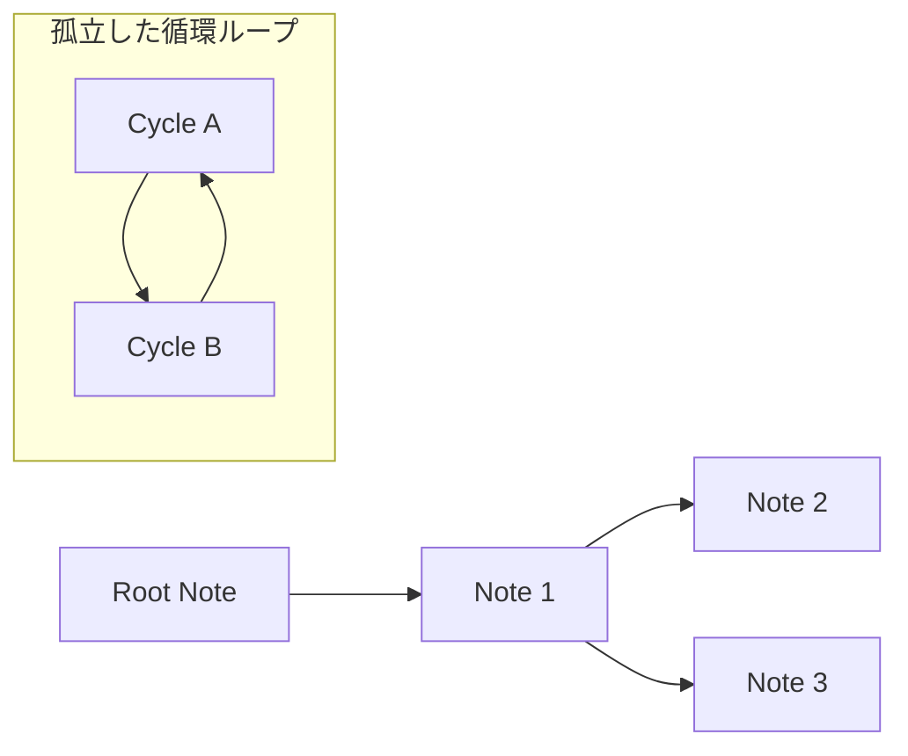

# Previous River の Canvas Export 機能の設計と実装

## 背景と目的 (Background)
`previous` プロパティによるノート間の繋がり（River）を、全体像として俯瞰・視覚化する機能を提供する。Obsidian Canvas形式（`.canvas`）でネットワークを出力し、リスト形式のテキストでは把握が困難な複雑な分岐や繋がりをグラフィカルに表現する。

## 概念定義 (Definitions)

- **ルートノート (Root Note)**: `previous` プロパティを持たない（または参照先が存在しない）が、他から子として参照されているネットワークの起点。
- **孤立した循環ループ (Isolated Cycle)**: 全てのノートが `previous` で環状に繋がり、ルートを持たない独立したグラフ。
- **折り返し配置 (Wrap Layout)**: 直線的なノートの連続が横に長くなりすぎるのを防ぐため、一定の列数に達した際に左端へ折り返して配置するレイアウト。



## 設計意図/ADR (Design Decisions)

| 候補 | 評価 | 結論 |
|---|---|---|
| Obsidian Graph View の活用 | 細かなノード配置や矢印の方向制御が不可能 | 却下 |
| `.canvas` ファイルの直接生成 | 座標（x, y）や接続辺（edges）を計算で完全に制御可能 | 採用 |

- **レイアウトの制約と対応**:
  - **ノードサイズの拡大**: `.canvas` 仕様ではプロパティ（Frontmatter）部分を初期状態で折りたためないため、ノードの高さを `500px` に拡大して本文のプレビュー領域を確保した。
  - **折り返し配置の導入**: 深さ優先探索（DFS）による単純な直線配置ではCanvasが横に間延びするため、`MAX_COLUMNS = 5` を上限とし、到達時にY座標を `+600px` シフトさせつつX座標を一番左（0）に戻すアルゴリズムを採用した。
  - **ツリー間の分離**: 複数のルートが存在する場合、個別のネットワークが重ならないよう、Y座標に `+1000px` のマージンを設定した。

## 実装 (Implementation)

### データ構造の定義

Obsidianの `.canvas` ファイルフォーマット仕様に合わせたインターフェース定義を行った。これにより、座標の計算やエッジの結合方向を型安全かつ直感的に記述することが可能になった。

```typescript
export interface CanvasNode {
    id: string;
    x: number;
    y: number;
    width: number;
    height: number;
    type: "file";
    file: string;
}

export interface CanvasEdge {
    id: string;
    fromNode: string;
    fromSide: "top" | "right" | "bottom" | "left";
    toNode: string;
    toSide: "top" | "right" | "bottom" | "left";
}

export interface CanvasData {
    nodes: CanvasNode[];
    edges: CanvasEdge[];
}
```

### レイアウトの計算

レイアウト計算とCanvas生成のロジックを `CanvasGenerator` クラスに集約した。

```typescript
class CanvasGenerator {
    // ...
    dfs(current: TFile, col: number, y: number, direction: number): string {
        const existingNodeId = this.fileToNodeId.get(current.path);
        if (existingNodeId) return existingNodeId; // 無限ループ（循環）の防止

        // ...

        let isWrapped = false;
        if (nextCol >= this.MAX_COLUMNS) {
            nextCol = 0; // 左端へ戻す
            nextY += yStep; // 下の段へ移動
            if (nextY > this.maxUsedY) this.maxUsedY = nextY;
            isWrapped = true;
        }
        
        // ...
        
        return nodeId;
    }
}
```

- **実装上の工夫**:
  - **矢印の方向（逆転の工夫）**: 実際の内部リンクは「子から親」の方向（`previous` プロパティ）に張られているが、Canvas上ではあえて逆方向である「親から子（起点 -> 次ノート）」へエッジを描画している。これにより、思考の派生や時間の流れを視覚的かつ直感的に捉えられるように工夫した。

## ユースケース (Usage)

- **複雑な思考の整理**: Zettelkastenや連なるメモの繋がりをCanvasとして出力し、マクロな視点でネットワークの構造を把握する。
- **Vault全体の監査**: コマンド `Export all rivers to canvas` を実行し、Vault内に存在するすべての `previous` ネットワークを一枚のCanvasに可視化。繋がりの途切れや孤立したループを発見する。
- **特定の条件に基づくネットワークの抽出**: コマンド `Export filtered rivers to canvas` を利用し、特定のディレクトリ、タグ、リンク等でフィルタリングされたノート群のみを含むCanvasを生成。特定のプロジェクトやテーマに絞った分析を可能にする。

## コマンド一覧

- `Export next notes to canvas`: 現在のノートを起点とする前方（子）への繋がりを出力。
- `Export all rivers to canvas`: Vault全体の繋がりをすべて出力。
- `Export filtered rivers to canvas`: 任意の条件（ディレクトリ、タグ、リンク等）に一致するノートが属するネットワークのみを抽出して出力。

## コミットログ

関連する主要なコミットは以下の通り。

- [`ce6f0d3`](https://github.com/ongaeshi/previous-river/commit/ce6f0d3) feat: Add command to export the next notes tree to a Canvas file
- [`9e89cc6`](https://github.com/ongaeshi/previous-river/commit/9e89cc6) feat: Add command to export all connected notes to a Canvas file
- [`9432f29`](https://github.com/ongaeshi/previous-river/commit/9432f29) refactor: Add confirmation dialog and extract canvas generation logic
- [`7716d36`](https://github.com/ongaeshi/previous-river/commit/7716d36) style: Increase Canvas node height and adjust vertical margins
- [`511e448`](https://github.com/ongaeshi/previous-river/commit/511e448) feat: Add export-filtered-rivers-to-canvas command

---
[⬅️ (previous) 002_find_last_note_optimization](002_find_last_note_optimization.md)
