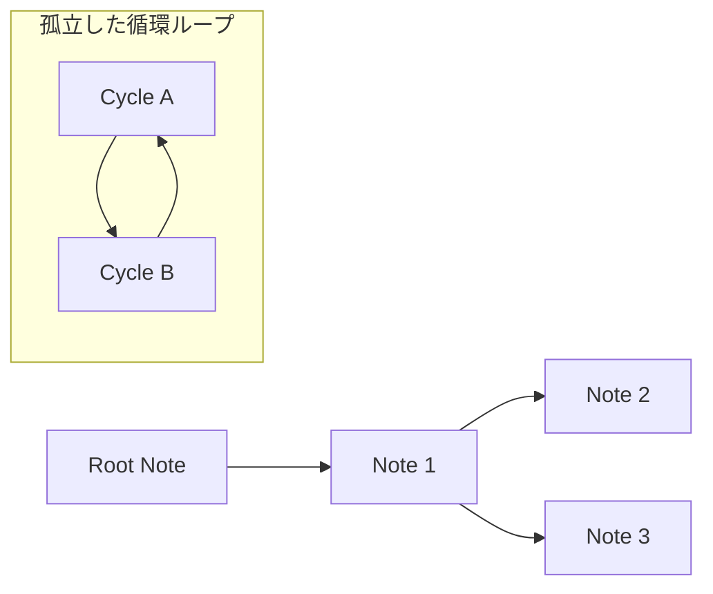

# Previous River の Canvas Export 機能の設計と実装

## 目的

`previous` プロパティによるノート間の繋がり（River）を、全体像として俯瞰・視覚化することを目指す。
Obsidian標準のGraph Viewでは困難な「ノード配置の完全な制御」と「矢印の方向性の意味付け」を、`.canvas` 形式での出力により実現する。これにより、テキストでは把握しきれない複雑な思考の分岐をグラフィカルに表現する。

## 用語の定義

- **ルートノート (Root Note)**: `previous` プロパティを持たない（または参照先が存在しない）が、他から子として参照されているネットワークの起点。
- **孤立した循環ループ (Isolated Cycle)**: 全てのノートが `previous` で環状に繋がり、ルートを持たない独立したグラフ。
- **折り返し配置 (Wrap Layout)**: 直線的なノートの連続が横に長くなりすぎるのを防ぐため、一定の列数に達した際に左端へ折り返して配置するレイアウト。



## 設計方針

Canvasファイルの生成とレイアウトアルゴリズムに関して、以下の検討を行った。

| 検討項目 | 採用案 | 却下案 | 理由 |
|---|---|---|---|
| 可視化の手段 | `.canvas` ファイルの直接生成 | Obsidian Graph View の活用 | Graph Viewでは細かなノード配置や矢印の方向（親子関係）の描画制御が不可能であったため。Canvas形式であれば、座標（x, y）や接続辺（edges）を計算で完全に制御可能である。 |
| ノードのサイズ | 高さを `500px` に拡大 | デフォルトサイズ | `.canvas` 仕様ではプロパティ（Frontmatter）部分を初期状態で折りたためず、本文が見えなくなってしまうため。本文のプレビュー領域を確保した。 |
| レイアウト方式 | 折り返し配置（Wrap Layout）の導入 | 単純な直線配置 | DFSによる直線配置では、チェインが長い場合にCanvasが横に間延びして視認性が低下するため。`MAX_COLUMNS = 5` を上限とし、到達時にY座標をシフトさせつつ左端へ折り返すアルゴリズムを採用した。 |
| エッジの方向 | 親から子（起点 -> 次ノート）へ描画 | 子から親（`previous` の方向）へ描画 | 実際の内部リンクは「子から親」の方向であるが、思考の派生や時間の流れを視覚的かつ直感的に捉えられるように工夫した。 |
| ツリー間の分離 | 個別のネットワーク間に `+1000px` のY座標マージンを設定 | - | 複数のルートやチェインが存在する場合、それぞれのグラフが重ならないようにするため。 |

## 実装

### データ構造の定義

Obsidianの `.canvas` ファイルフォーマット仕様に合わせたインターフェース定義を行った。これにより、座標の計算やエッジの結合方向を型安全かつ直感的に記述することが可能になった。

```typescript
export interface CanvasNode {
  id: string;
  x: number;
  y: number;
  width: number;
  height: number;
  type: "file";
  file: string;
}

export interface CanvasEdge {
  id: string;
  fromNode: string;
  fromSide: "top" | "right" | "bottom" | "left";
  toNode: string;
  toSide: "top" | "right" | "bottom" | "left";
}

export interface CanvasData {
  nodes: CanvasNode[];
  edges: CanvasEdge[];
}
```

### レイアウトの計算

レイアウト計算とCanvas生成のロジックを `CanvasGenerator` クラスに集約した。DFS（深さ優先探索）を用いてノードを配置し、循環参照の防止や折り返し処理を組み込んでいる。

```typescript
class CanvasGenerator {
  // ...
  dfs(current: TFile, col: number, y: number, direction: number): string {
    const existingNodeId = this.fileToNodeId.get(current.path);
    if (existingNodeId) return existingNodeId; // 無限ループ（循環）の防止

    // ...

    let isWrapped = false;
    if (nextCol >= this.MAX_COLUMNS) {
      nextCol = 0; // 左端へ戻す
      nextY += yStep; // 下の段へ移動
      if (nextY > this.maxUsedY) this.maxUsedY = nextY;
      isWrapped = true;
    }
    
    // ...
    
    return nodeId;
  }
}
```

## コマンド一覧

Previous River プラグインでは、Canvasエクスポートに関して以下のコマンドが提供されている。

| コマンド名 | 概要 |
|---|---|
| **Export next notes to canvas** | カレントノートを起点とする前方（子）へのネットワークをCanvasファイルとして出力する |
| **Export all rivers to canvas** | Vault内に存在するすべてのノートの繋がり（チェイン）を1枚のCanvasファイルとして一括出力する |
| **Export filtered rivers to canvas** | 検索条件（パス、タグ、リンク等）に合致するノートが属するネットワークのみを抽出してCanvasファイルとして出力する |

## ユースケース

- **複雑な思考の整理**: Zettelkastenや連なるメモの繋がりをCanvasとして出力し、マクロな視点でネットワークの構造や分岐を把握する。
- **Vault全体の監査**: `Export all rivers to canvas` を実行し、繋がりの途切れや孤立したループを発見する。これにより、ノート間の不整合な参照構造を可視化して修正の手がかりとする。
- **特定のプロジェクトの分析**: `Export filtered rivers to canvas` を利用し、特定のディレクトリやタグに属するノート群のネットワークのみを抽出。特定のプロジェクトやテーマに絞った分析を容易にする。

## コミットログ

関連する主要なコミット履歴を提示する。

- [ce6f0d3](https://github.com/ongaeshi/previous-river/commit/ce6f0d3) feat: 次のノートツリーをCanvasファイルにエクスポートするコマンドを追加
- [9e89cc6](https://github.com/ongaeshi/previous-river/commit/9e89cc6) feat: 接続されたすべてのノートをCanvasファイルにエクスポートするコマンドを追加
- [9432f29](https://github.com/ongaeshi/previous-river/commit/9432f29) refactor: 確認ダイアログを追加し、Canvas生成ロジックを抽出
- [7716d36](https://github.com/ongaeshi/previous-river/commit/7716d36) style: Canvasノードの高さを増やし、垂直マージンを調整
- [511e448](https://github.com/ongaeshi/previous-river/commit/511e448) feat: export-filtered-rivers-to-canvas コマンドを追加

---
[⬅️ (previous) 002_find_last_note_optimization](002_find_last_note_optimization.md)
